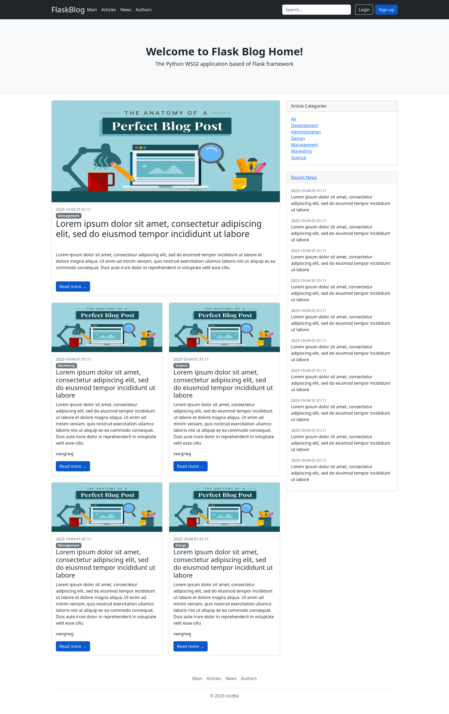

# Flask Blog Website  
___
### Description
Blog web application based on Flask framework with systems of verification, password recovery, administration, user's profile, creating and editing posts.
As a database can be used SQLite or PostgreSQL.
Application can be launched as Docker container.



___
### Getting Started
#### Running on Local Machine
+ install dependencies using PIP
````
$ pip install -r requirements.txt 
````
+ configure environment variables in `.env` file
+ add app entrypoint
````
$ set FLASK_APP=wsgi.py
````
+  init alembic
````
$ flask db init
````
+  generate an initial migration
````
$ flask db migrate -m "Initial"
````
+ create database tables
````
$ flask db upgrade
````
+ (optional) create superuser
````
$ flask create-superuser [OPTIONS] USERNAME PASSWORD
````
+ start app in virtual environment
````
$ gunicorn -c gunicorn.conf.py uwsgi:app
````
____
#### Environment variables
| variables             | description                                          |
|:----------------------|:-----------------------------------------------------|
| `PORT`                | application port                                     |
| `SECRETKEY`           | a secret key for securely signing the session cookie |
| `CSRFSECRETKEY`       | CSRF secret key                                      |
| `PGUSER`              | PostgreSQL user                                      |
| `PGHOST`              | hostname or an IP address PostgreSQL database        |
| `PGPORT`              | PostgreSQL database port                             |
| `PGDB`                | PostgreSQL database name                             |
| `PGPASSWORD`          | PostgreSQL database password                         |
| `EMAILSMTPSERVER`     | email SMTP server                                    |
| `EMAILPORT`           | email port                                           |
| `EMAIL`               | email address                                        |
| `EMAILPASSWORD`       | email password                                       |
| `RECAPTCHAPUBLICKEY`  | reCAPTCHA V2 public key                              |
| `RECAPTCHAPRIVATEKEY` | reCAPTCHA V2 private key                             |
____
#### Tech Stack
+ `Flask`
+ `Flask-SQLAlchemy`
+ `Flask-Migrate`
+ `Flask-Login`
+ `Flask-WTF`
+ `Flask-RedMail`
+ `Flask-JWTManager`
+ `Pillow`
+ `gunicorn`