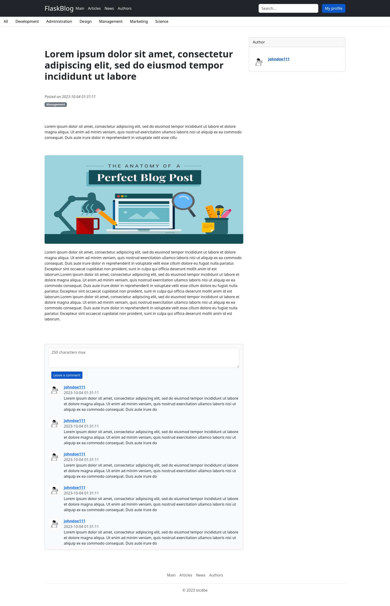

# Flask Blog
___
### Description
Web application based on Flask with systems of verification, password recovery via email, administration, user's profile, creating, updating and deleting posts.




___
### Getting Started
#### Running on Local Machine
+ install dependencies using Poetry
````
$ poetry install --no-root
````
+ configure environment variables in `.env` file
+ add app entrypoint
````
$ set FLASK_APP=wsgi.py
````
+ create migration in database
````
$ flask db upgrade
````
+ (optional) create superuser
````
$ flask create-superuser [OPTIONS] USERNAME EMAIL PASSWORD
````
+ start app in virtual environment
````
$ gunicorn -c gunicorn.conf.py wsgi:app
````
+ start celery worker as independent process
````
$ celery -A wsgi.celery_app worker --loglevel WARNING
````
#### Launch in Docker
+ configure environment variables in `.env` file
+ building the docker image
````
$ docker compose build
````
+ start service
````
$ docker compose up -d
````
____
#### Environment variables
| variables                 | description                                      |
|:--------------------------|:-------------------------------------------------|
| `HOST`                    | app host                                         |
| `PORT`                    | app port                                         |
| `DEBUG`                   | debug mode, only allowed 1(True)/0(False)        |
| `SECRET_KEY`              | a secret key for the session cookie              |
| `CSRF_SECRET_KEY`         | CSRF secret key                                  |
| `CSRF_TIME_LIMIT`         | CSRF token lifetime in minutes                   |
| `PG_USER`                 | PGSQL user                                       |
| `PG_HOST`                 | hostname or an IP address PGSQL database         |
| `PG_PORT`                 | PGSQL database port                              |
| `PG_DB`                   | PGSQL database name                              |
| `PG_PASSWORD`             | PGSQL database password                          |
| `PG_USER_TEST`            | PGSQL test user                                  |
| `PG_PASSWORD_TEST`        | PGSQL test user password                         |
| `PG_HOST_TEST`            | hostname or an IP address of PGSQL test database |
| `PG_PORT_TEST`            | port from PGSQL test database                    |
| `PG_DB_TEST`              | PGSQL test database                              |
| `REDIS_HOST`              | Redis host                                       |
| `REDIS_PORT`              | Redis port                                       |
| `EMAIL_SMTP_SERVER`       | email SMTP server                                |
| `EMAIL_PORT`              | email port                                       |
| `EMAIL_USERNAME`          | email address                                    |
| `EMAIL_PASSWORD`          | email password                                   |
| `EMAIL_SENDER`            | email sender                                     |
| `TEST_EMAIL_RECEIVER`     | test email receiver                              |
| `RESET_PSW_TOKEN_EXPIRES` | reset password token lifetime in minutes         |
| `RECAPTCHA_PUBLIC_KEY`    | reCAPTCHA V2 public key                          |
| `RECAPTCHA_PRIVATE_KEY`   | reCAPTCHA V2 private key                         |
____
#### Tech Stack
+ `Flask`
+ `Flask-SQLAlchemy` and `Flask-Migrate`
+ `Flask-Login`
+ `Flask-WTF`
+ `Flask-JWT-Extended`
+ `Flask-Injector`
+ `Pillow`
+ `Celery`
+ `Redis`
+ `gunicorn`
+ `docker`
